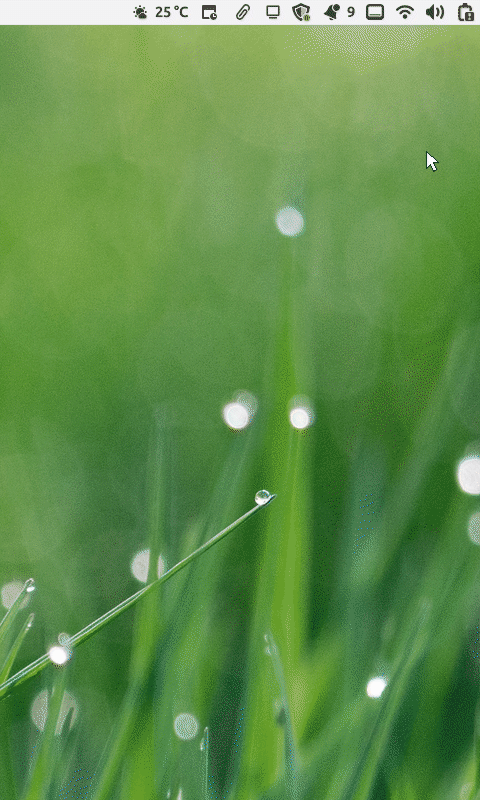
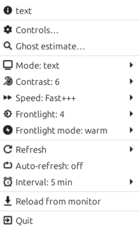
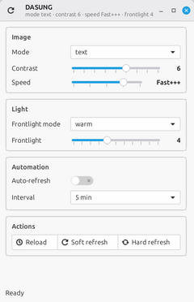
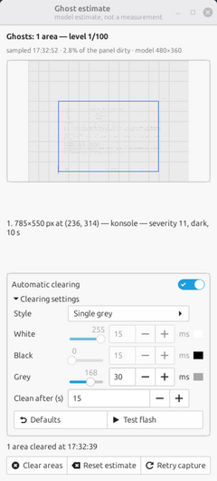

# dasungctl

`dasungctl` puts a Dasung e-ink monitor under a Linux system-tray icon, to
read and write on it more comfortably: change display mode, contrast, speed,
frontlight and color temperature, send a soft or hard refresh, or let an
auto-refresh timer keep the panel fresh on its own. It also watches the
screen for ghosting: an experimental estimate marks the areas that are
probably still showing old ink and can flash them away automatically, zone
by zone, through a local overlay — no serial command is invented for it.

It speaks the monitor's CH340 serial interface with the frames recovered
from Dasung's official clients and waits for the monitor's acknowledgement
before reporting success. The only confirmed model is the **Dasung Paperlike
HD Revolutionary 13.3″ (40 Hz, protocol `0x30`), the HD-FT variant with
frontlight and touchscreen**; other Dasung models are untested, but every
panel-specific value lives in one small profile, so adding a monitor means
filling that profile instead of changing the code. It runs on Linux with
X11 or Wayland and has been tested on Linux Mint (Cinnamon) and Fedora (KDE
Plasma).

<p align="center">
  
</p>

| [](docs/images/tray-menu.png) | [](docs/images/controls.png) | [](docs/images/ghost-estimate.png) |
| :---: | :---: | :---: |
| The tray menu with the values read from the monitor | `Controls…` — mode, contrast, speed, frontlight and auto-refresh | `Ghost estimate…` on a real ghost, with the automatic clearing settings |

*The animation shows the tray flow; click a screenshot for the full-resolution version. The animation and screenshots above refer to version 0.1.*

## What it does

- Tray icon (StatusNotifierItem) on Cinnamon, GNOME (with the AppIndicator
  extension) and KDE: display mode, contrast, speed, the ten frontlight
  levels, frontlight mode and the custom color temperature, soft/hard
  refresh and an auto-refresh timer.
- `Controls…` window with sliders, live values and a status line; the last
  configuration is saved and applied again at startup.
- Optional JSON configuration and a per-run log file, mirrored on the
  terminal when started from one; Ctrl+C or SIGTERM exit cleanly.
- `dasungctl devices` and `dasungctl doctor` for serial diagnostics; the
  doctor prints the active panel profile and warns when the monitor reports
  a different protocol version.
- **Automatic zone clearing**: when the ghost estimate sees an area getting
  old, the tray flashes it white or grey with a borderless overlay — an X11
  window or a Wayland layer-shell surface — so the controller rewrites those
  pixels. All due areas are cleared in one synchronized wave, even while the
  screen is in use, and the estimate for each area is reset afterwards.
- `Ghost estimate…` diagnostic window: ghost-only preview, the list of estimated
  areas with their application, severity, polarity and age, the clearing
  switch, the flash settings editor and a `Test flash` preview.

## Compatibility

- **Panel:** only the Dasung Paperlike HD Revolutionary 13.3″ (40 Hz,
  protocol `0x30`), in its HD-FT variant with frontlight and touchscreen.
  Other Paperlike models and protocol families are not supported or tested;
  they need their own profile — Dasung's current 13.3-inch model, the
  Paperlike 13K (37 Hz, 3200×2400), is one of them. All model-specific
  tables are collected in one place and
  [docs/panels.md](docs/panels.md) explains how to add a model from captured
  evidence.
- **System:** Linux with a GTK 3 desktop. The serial control does not depend
  on the display server; the tray and the ghost estimate are tested on Linux
  Mint (Cinnamon, X11) and Fedora (KDE Plasma, Wayland). On Wayland the
  capture goes through the ScreenCast portal, the window labels through KWin
  scripting and zone clearing through layer-shell (KDE and wlroots, not
  GNOME) ([docs/development.md](docs/development.md)).

## How it works

- **Serial.** 12-byte ASCII-hex frames at 115200 baud on the CH340; the
  confirmed reads, writes and calibrations are in
  [docs/protocol.md](docs/protocol.md). Reads and writes are acknowledged;
  only one process can hold the monitor at a time.
- **Tray.** GTK 3 and the Ayatana AppIndicator bindings over the
  StatusNotifierItem D-Bus protocol. The bindings come from the system
  Python, not from pip, so the tray re-executes itself with the system
  Python whenever it starts in an interpreter without them (a `pipx`
  install, a development virtualenv).
- **Ghost estimate.** A low-resolution model keeps the old ink seen in the
  captured screen, dark residue on light content and light residue on dark
  content; areas older than a delay are flashed by a borderless overlay,
  which makes the controller rewrite those pixels. There is no regional
  serial command, so none is invented.

## Installation

Python 3.10 or newer, a Dasung monitor connected over USB, and a Linux
desktop with GTK 3 for the tray. No virtualenv is needed: install the system
packages and run the program from the checkout.

```console
# Debian/Ubuntu (Mint, X11)
sudo apt install python3-serial python3-gi gir1.2-gtk-3.0 \
  gir1.2-ayatanaappindicator3-0.1 python3-xlib
# Fedora (KDE, Wayland)
sudo dnf install python3-pyserial python3-gobject gtk3 \
  libayatana-appindicator-gtk3 gtk-layer-shell
git clone https://github.com/sal7g86/eink-dasung-control.git
cd eink-dasung-control
python3 src/_source_run.py
```

`python3` must be the interpreter that owns the GTK bindings (on Mint,
Ubuntu and Fedora it is `/usr/bin/python3`). If you want a `dasungctl`
command on `PATH`, `dasungctl tray --install-launcher` writes a small
launcher that runs the checkout and explains a missing disk, and
`pipx install .` does it cleanly too: pipx keeps the program in its own
virtualenv, and the tray re-executes itself with the system Python, so the
GTK bindings are still found. `python3 -m pip install --user .` is the
manual variant, and on distributions with PEP 668 it needs
`--break-system-packages`. Package details, the optional X11 window labels
and serial permissions are covered in
[docs/installation.md](docs/installation.md).

On a Wayland session the first sample opens the screen-share dialog: pick
the Dasung monitor there, and the capture stays on that monitor only. The
grant is remembered, so later starts are silent; local zone clearing needs
`gtk-layer-shell` (KDE and wlroots, not GNOME).

## Usage

```console
dasungctl                 # the tray icon
dasungctl devices         # list serial devices without opening them
dasungctl doctor          # diagnose the serial connection and the panel
```

The `tray` word is optional; `--device`, `--timeout`, `--interval` and
`--config` override the configuration. `dasungctl tray --install-autostart`
writes the login entry. The menu and window controls are described in
[docs/tray.md](docs/tray.md).

## E-ink terminal theme

A terminal on the panel is easier to read with a light, grayscale color
scheme: the colors of a normal theme dither into patterns on e-ink and leave
more ghost behind. The MIT-licensed
[konsole-eink](https://github.com/asapelkin/konsole-eink) theme by asapelkin
is recommended for KDE Konsole:

```console
git clone https://github.com/asapelkin/konsole-eink
mkdir -p ~/.local/share/konsole
cp konsole-eink/konsole-eink.colorscheme ~/.local/share/konsole/
```

Then choose `E-Ink Color Scheme` in Konsole's profile settings. The theme is
a separate project and is not part of this repository.

## Documentation

| Document | Contents |
| --- | --- |
| [docs/installation.md](docs/installation.md) | environment, packages, serial permissions |
| [docs/tray.md](docs/tray.md) | menu, windows, physical controls, scope |
| [docs/configuration.md](docs/configuration.md) | config, saved state and log files |
| [docs/panels.md](docs/panels.md) | panel profiles and how to add another model |
| [docs/ghost-estimate.md](docs/ghost-estimate.md) | the experimental ghost estimate and zone clearing |
| [docs/protocol.md](docs/protocol.md) | confirmed serial protocol, captures, open questions |
| [docs/research-findings.md](docs/research-findings.md) | distilled official-client static analysis |
| [docs/development.md](docs/development.md) | tests, lint, release |
| [docs/changelog.md](docs/changelog.md) | release history |

## Status

0.1.4, alpha. Monitor control is conservative and verified against the
recorded captures; the ghost estimate is experimental and still needs
calibration on the panel. See [docs/ghost-estimate.md](docs/ghost-estimate.md)
for the known limitations.

## Tests

The tests use recorded frames and fakes and never open a serial device:

```console
python -m pytest -q
uvx ruff check src tests --select F,E9
```

## License

Apache License 2.0: free to use, modify and share, provided the copyright,
the license and the [NOTICE](NOTICE) file (author `sal7g86`, project
`dasungctl`) are kept. See [LICENSE](LICENSE).
